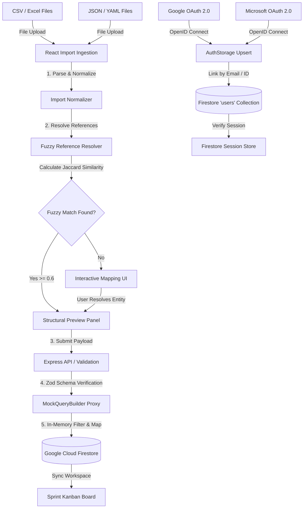

# Project Simple

A structural service-delivery operating system that models project hierarchies, normalizes external data imports, validates schemas before persistence, manages sprint workspaces, and links multi-provider OAuth identities to a central user.

### Try it

*   **Live Demo**: [https://project-simple--project-simple-7478e.us-central1.hosted.app/](https://project-simple--project-simple-7478e.us-central1.hosted.app/)
*   **Repository**: [GitHub Repository](https://github.com/osogroup-blair/projectMGMT_showcase)
*   **Architecture**: [System Architecture](#system-architecture)

> [!TODO]
> **Recommended Screenshots for Portfolio Review:**
> 1.  **Workspace/Dashboard**: Showing client workspaces and active delivery metrics.
> 2.  **Six-Step Project Builder**: Guided workflow displaying WBS setup and roles configuration.
> 3.  **Import Mapping & Reconciliation Screen**: Fuzzy matching conflicts and manual mapping interface.
> 4.  **Kanban Workspace**: Active tasks grouped by custom sprint columns.

---

## The Problem

Service-delivery organizations coordinate complex operations across projects, deliverables, epics, tasks, team members, delivery roles, active sprint states, client-specific structures, and external data sources. In practice, this data is often distributed across fragmented systems and spreadsheet sheets that lack a shared, cohesive domain model. 

When organizations attempt to integrate this data, they face two key challenges:
1.  **Relational Mismatch**: Flat task lists in traditional project management tools fail to enforce hierarchical relationships (e.g., ensuring a task belongs to an Epic, which belongs to a Deliverable, which belongs to a Project).
2.  **Entity Fragmentation**: Messy external spreadsheets use inconsistent naming conventions for roles and assignees (e.g., "Sr. Solution Architect" vs. "Lead Architect"). Silently importing these records creates duplicate or orphaned entities, corrupting the system of record.

Project Simple was built to represent these operational relationships explicitly, enforcing structural integrity and providing a controlled environment for importing, reconciling, and executing project delivery.

---

## What I Built

Project Simple is a web application designed to normalize, validate, and operate project workspaces. It features:
*   **A Structured Work Breakdown Structure (WBS) Model**: Enforces a strict, four-tier hierarchy: `Project -> Deliverable -> Epic -> Task`.
*   **A Human-in-the-Loop Import Engine**: Parses CSV, Excel, JSON, and YAML project exports, executing fuzzy reconciliation against existing system users and roles, and presenting structural previews before database write.
*   **An Identity-Linking SSO System**: Maps Google and Microsoft OAuth profiles to a single central user identity, preserving permissions and settings across providers.
*   **A Fluent Firestore Query Broker**: Bridges the relational domain code with a serverless NoSQL database (Google Cloud Firestore) using a custom proxy that emulates Drizzle ORM query patterns.

---

## How the System Works

The following diagram illustrates the lifecycle of project data from ingestion and reconciliation to persistence and execution:



---

## Smart Import & Entity Resolution

The import engine resolves the boundary mismatch between unstructured external spreadsheets and the system's strict internal schema. 

### 1. Ingestion Pipeline
*   **Parsing**: Reads uploaded CSV, Excel (`.xlsx`), JSON, or YAML files using `xlsx` and `js-yaml` libraries.
*   **Normalization**: Extracts core project columns (e.g., tasks, epic names, delivery roles, assignee emails).
*   **Entity Reference Resolution**: Resolves external assignees and roles to existing database records using a tiered matching strategy.

### 2. The Matching Algorithm
The resolver evaluates string similarity using a custom Jaccard similarity index tokenized by words, combined with a substring containment bonus:

$$\text{Jaccard Similarity} = \frac{|A \cap B|}{|A \cup B|}$$

```typescript
function calculateSimilarity(a: string, b: string): number {
  if (a === b) return 1;
  if (!a || !b) return 0;

  const aWords = a.split(/\s+/);
  const bWords = b.split(/\s+/);
  const aSet = new Set(aWords);
  const bSet = new Set(bWords);
  
  const intersectionCount = aWords.filter(x => bSet.has(x)).length;
  const unionSet = new Set(aWords.concat(bWords));
  
  const jaccard = intersectionCount / unionSet.size;

  const longer = a.length > b.length ? a : b;
  const shorter = a.length > b.length ? b : a;
  
  // Apply a containment bonus if one string contains the other
  const containsBonus = longer.includes(shorter) ? 0.2 : 0;
  
  return Math.min(1, jaccard + containsBonus);
}
```

*   **Confidence Thresholds**:
    *   **High Confidence (1.0)**: Exact match on Unique ID or email address.
    *   **Medium Confidence (>= 0.6)**: Fuzzy match calculated via Jaccard similarity + containment bonus.
    *   **Low / Unresolved (< 0.6)**: Surfaced to the UI for manual human-in-the-loop matching.

### 3. Concrete Example: Role Resolution
When importing a project sheet containing external roles:

| External Sheet Value | System Database Value | Similarity Score | Resolution |
| :--- | :--- | :--- | :--- |
| `Sr. Solution Architect` | `Lead Architect` | `0.67` (Medium) | System suggests match; user confirms. |
| `External Developer` | *None* | `0.00` (Low) | Unresolved; user maps to `Software Engineer` or skips. |

---

## Design Decisions

### Hierarchical Work Model vs. Flat Task Lists
Most project management tools treat tasks as top-level records with labels or tags. In complex service delivery, this lack of structure leads to scoping errors. Project Simple models the hierarchy `Project -> Deliverable -> Epic -> Task` as strict database parent-child relationships. The user interface reflects this by restricting task creation to active epics, ensuring clean Work Breakdown Structure reporting and progress rollups.

### Human-in-the-Loop Import Gate
Automated imports often result in database pollution (e.g., creating duplicate user profiles for "john.doe" and "John Doe"). The import engine halts execution when unresolved references are detected, forcing users to explicitly map them in the UI. 

### Structural Preview before DB Execution
Imported projects are verified client-side using `import-validation.ts` before writing to the database. Users review warning alerts (e.g., unassigned tasks, missing milestones) in a structural tree preview, preventing malformed hierarchies from persisting.

### Multi-Provider Identity Linking
Users often register with different credentials (e.g., logging in via Google for personal use and Microsoft for corporate client work). The authentication storage handler (`server/integrations/auth/storage.ts`) uses a matching sequence:
1.  Check for existing user by primary authentication provider ID.
2.  If not found, query for an existing user by email address.
3.  If email matches, update the existing user record with the new provider's `externalId` (linking the accounts) instead of generating a duplicate user record.

### Firestore Session Store
Instead of depending on an external Redis or PostgreSQL instance for sessions, the system uses a custom `FirestoreStore` wrapper (`server/integrations/auth/sessionAuth.ts`). This implementation persists serialized Express session data directly inside a `sessions` collection in Firestore, keeping the infrastructure entirely serverless.

### Drizzle-to-Firestore Query Broker (`MockQueryBuilder`)
To support development flexibility, the system uses a custom fluent database proxy client (`server/db/index.ts`) that emulates Drizzle ORM's syntax (`db.select().from(table).where(...)`) over Firestore collections.

*   **How it works**: The builder translates Drizzle SQL expressions into conditions, extracts filters, and queries Firestore collections.
*   **Architectural Trade-offs & Limitations**:
    *   **In-Memory Filtering**: To support arbitrary SQL operators (`!=`, `is null`, `in`, complex expressions) without generating dozens of composite indexes in Firestore, the broker fetches all documents in a collection and applies filtering, ordering, and pagination in-memory. 
    *   **Scale Limitation**: This works efficiently for prototype and demo scale but is not suitable for collections exceeding thousands of documents, where native server-side query routing is required.
    *   **Batch Writes**: Inserts and updates are executed sequentially on document references rather than native transaction batches.

---

## System Architecture

The application is structured into clear service and operational boundaries:

### 1. Frontend
*   **React 19 & TypeScript**: Provides component rendering and type safety.
*   **Vite**: Manages client bundling and dev server hot-reloading.
*   **TanStack Query**: Handles caching, API requests, and optimistic UI updates.
*   **Radix UI & Tailwind CSS**: Implements design tokens, accessibility primitives, and micro-animations.

### 2. Backend
*   **Node.js & Express**: Exposes REST API endpoints.
*   **Passport.js**: Orchestrates cookie sessions and OAuth authentication strategies.

### 3. Database & Storage
*   **Google Cloud Firestore**: Serves as the document database.
*   **Firestore Emulator**: Provides local database isolation inside a Docker container.

### 4. Identity Providers
*   **Google OAuth 2.0 & Microsoft Microsoft Entra ID (Azure AD)**: Handles external authentication.

---

## Core Capabilities

### Project Architecture
*   **WBS Wizard**: A guided, six-step wizard mapping projects from high-level metadata down to task-level details.
*   **Delivery Framework Templates**: Pre-populates stages and milestones using customizable delivery frameworks.
*   **Role Mapping**: Binds delivery roles (e.g., Lead Architect, Project Manager) to project instances.

### Data Ingestion and Reconciliation
*   **Multi-Format Import**: Ingests JSON, CSV, and YAML files.
*   **Entity Mapping UI**: Resolves import conflicts through manual dropdown mapping.
*   **Validation Panel**: Validates task assignments and reports configuration warnings.

### Execution
*   **Sprint Kanban Boards**: Handles active task states using drag-and-drop support.
*   **Sprint Boundaries**: Schedules active sprint timelines and tracks milestone completion.

### Identity and Access
*   **SSO Account Linking**: Binds Google and Microsoft credentials.
*   **Firestore Session Provider**: Manages session state via Firestore.

---

## Example End-to-End Flow

### Creating a Project via the Setup Wizard
1.  **Wizard Initiation**: The user opens the React wizard interface, triggering steps validated by `react-hook-form`.
2.  **Metadata Definition**: User enters project scope, timeline, and client styling parameters.
3.  **WBS Construction**: User selects a delivery template, automatically generating stages (e.g., Discovery, Architecture, Build).
4.  **Team Role Assignment**: User assigns team members to predefined delivery roles.
5.  **Hierarchy Generation**: The frontend compiles the structure: `Project -> Deliverable -> Epic -> Task`.
6.  **Structural Preview**: User verifies the generated task list and milestone badges.
7.  **HTTP Request**: Frontend posts the JSON payload to the `/api/projects/full-create` endpoint.
8.  **Server Verification**: Express parses the payload using a Zod schema (`fullProjectCreatePayloadSchema`).
9.  **Firestore Persistence**: The server calls the query proxy (`db.insert`), persisting the records across `projects`, `deliverables`, `epics`, and `tasks` collections.
10. **Workspace Workspace Sync**: TanStack Query invalidates the cache, updating the active Kanban board with the new project tasks.

---

## What This Project Demonstrates

*   **Hierarchical Domain Modeling**: Enforcing structural integrity across nested relationships.
*   **Data Reconciliation & Ingestion**: Implementing token-based Jaccard similarity algorithms with a fallback UI for human review.
*   **OAuth Identity Linking**: Resolving multi-provider authentication records.
*   **Database Query Abstraction**: Building a compatibility wrapper (`MockQueryBuilder`) to emulate SQL ORM patterns on top of a serverless document store.
*   **Full-Stack TypeScript**: Implementing end-to-end type safety between the Express backend and React frontend.

---

## Technology Stack

*   **Languages**: TypeScript, JavaScript, SQL (Schema Definitions)
*   **Frontend**: React 19, Vite, TanStack Query, Radix UI, Tailwind CSS, Lucide Icons, Recharts, Framer Motion
*   **Backend**: Node.js, Express, Passport.js, Zod
*   **Database**: Google Cloud Firestore, Firebase SDK
*   **Testing/Dev Ops**: Docker, Docker Compose, Firebase Local Emulator, App Hosting

---

## Repository Structure

```
├── .firebase/                  # Firebase Cache and Local Configuration
├── client/                     # Frontend React Project
│   ├── src/
│   │   ├── components/         # Reusable UI Elements (Kanban, Import, Wizards)
│   │   ├── hooks/              # Custom React Hooks
│   │   ├── lib/                # Ingestion Validators & Matching Algorithms
│   │   ├── pages/              # Workspace, Admin, Dashboard, Import Wizard Pages
│   │   └── App.tsx             # Main Client Router (wouter)
├── server/                     # Backend Express App
│   ├── api/routes/             # REST Endpoints (Import, Projects, Auth)
│   ├── db/                     # MockQueryBuilder Proxy & Init Configuration
│   ├── integrations/auth/      # Google/Microsoft SSO & Session Store
│   └── index.ts                # Application Entry Point
├── shared/                     # Shared TypeScript Schemas & Types
│   ├── creation-result-types.ts# Import Validation Schemas
│   └── schema.ts               # Database Zod and Model Schemas
├── apphosting.yaml             # GCP Firebase App Hosting Configuration
├── docker-compose.yml          # Firestore Emulator Setup
├── package.json                # Project Dependencies & Scripts
└── README.md                   # System Documentation
```

---

## Running Locally

### Prerequisites
*   Node.js (v18+)
*   Docker & Docker Compose

### 1. Environment Setup
Clone the repository and copy the environment template:
```bash
cp .env.example .env
```
Ensure your `.env` contains the default Firestore local emulator variables:
```env
FIREBASE_PROJECT_ID=demo-projectmgmt
FIRESTORE_EMULATOR_HOST=127.0.0.1:8082
SESSION_SECRET=local-dev-only-secret-key-123
PORT=8080
```

### 2. Launch Firestore Local Emulator
Launch the emulator container:
```bash
docker compose up db -d
```
The Firestore emulator will run on port `8082`, and the Emulator Suite UI will be accessible at `http://localhost:4000`.

### 3. Install Dependencies
```bash
npm install
```

### 4. Run the Development Server
```bash
npm run dev
```
On startup, the server checks if the Firestore database is empty. If empty, it automatically seeds default roles, task templates, and mock projects.

### 5. Access the Application
Open your browser and navigate to `http://localhost:8080`. Click the **"Try Demo"** button to log in instantly.

---

## Configuration

The application is configured using variables defined in `.env`:

*   `FIREBASE_PROJECT_ID`: The target Google Cloud Project ID.
*   `FIRESTORE_EMULATOR_HOST`: Configures the Firebase Admin SDK to redirect requests to the local emulator.
*   `SESSION_SECRET`: Session signature key.
*   `PORT`: Port the Express server listens on.
*   `MICROSOFT_CLIENT_ID` / `MICROSOFT_CLIENT_SECRET` / `MICROSOFT_TENANT_ID`: Microsoft Entra ID credentials.
*   `GOOGLE_CLIENT_ID` / `GOOGLE_CLIENT_SECRET`: Google OAuth credentials.

---

## Deployment

### Firebase App Hosting
The repository includes an `apphosting.yaml` file pre-configured for Firebase App Hosting:
*   Deploys the Express app as a serverless container instance.
*   Sets environment variables such as `FIREBASE_PROJECT_ID` and `NODE_ENV`.
*   Connects automatically to the production Firestore database in the target project.

### Docker Production Setup
For general VPS/VM deployment:
1.  Uncomment the `app` service blocks inside `docker-compose.yml`.
2.  Set production credentials in `.env`.
3.  Deploy using:
```bash
docker compose up -d --build
```

---

## Security Notes

*   **Credential Separation**: Sensitive settings, OAuth client secrets, and database credentials must be placed in `.env` and kept out of version control.
*   **SSO Account Linking Security**: User email validation matches verified emails returned from trusted OpenID Connect providers (Google & Microsoft) before merging accounts, preventing identity spoofing.
*   **Firestore Rules**: Production access rules are defined in `firestore.rules` to prevent unauthorized document reads and writes.

---

## Project Status

The codebase is fully functional. The backend Express API, React frontend, database emulator environment, and custom Jaccard similarity matcher are complete and verified.

---

## Author / Background

Developed by Blair to demonstrate service-delivery schema modeling, data mapping algorithms, database abstraction patterns, and multi-provider identity federation inside a serverless cloud architecture.
