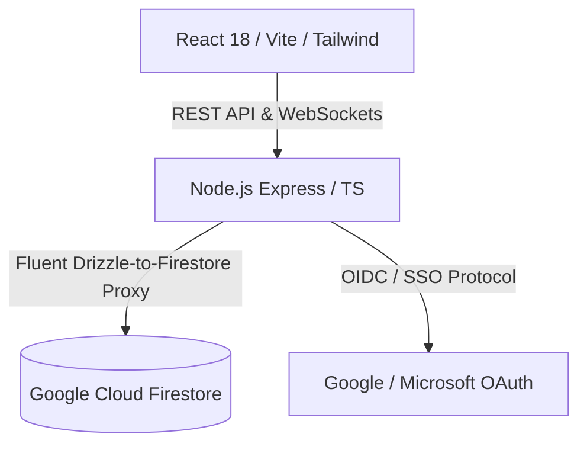

# 🚀 Nexus: Enterprise Service Delivery Workspace

**Nexus** is an enterprise-grade project management workspace designed specifically for service delivery organizations. Built to solve WBS (Work Breakdown Structure) visualization, client resource tracking, and theme personalization, it transitions the traditional model of heavy SQL systems into a modern serverless architecture powered by **Google Cloud Firestore**.

---

## 🎨 System Demonstration & Visuals

The application features a sleek, modern UI with rich micro-animations, customizable dark/light styling tokens, and an interactive workspace dashboard:

*   **Multi-Step Project Builder**: A guided, 6-step wizard mapping projects from WBS down to tasks.
*   **Active Kanban Workspace**: Live task boards with drag-and-drop support.
*   **Personalization System**: Custom client theme generator applying style tokens instantly.

---

## ✨ Core Features

### 1. 🧙‍♂️ Guided Project Setup Wizard
A structured registration pipeline designed to configure delivery templates easily:
*   **WBS Definition**: Organizes hierarchical relations: `Project` ➔ `Deliverables` ➔ `Epics` ➔ `Tasks`.
*   **Workflow Mapping**: Pre-populates phases using customizable delivery frameworks.
*   **Role-Based Team Selection**: Assigns roles (e.g., Lead Architect, Project Manager, Delivery Executive) to team members.
*   **Live WBS Preview**: Real-time summary and task counting badges verifying your configuration before activation.

### 2. 🔀 Smart Import/Export Engine
A data-exchange system supporting **JSON, CSV/Excel, and YAML** imports:
*   **Fuzzy Reference Resolution**: Resolves team members and roles automatically via string-distance algorithms.
*   **Interactive Mapping UI**: Allows mapping unrecognized external roles to existing platform entities.
*   **Structural Review Panel**: Visual preview of Epics and Tasks hierarchical structures before database execution.

### 3. 📋 Sprint Kanban Boards
Dynamic workspace enabling teams to organize execution cycles:
*   **Interactive Kanban**: Drag-and-drop tasks across custom columns (`Backlog`, `In Progress`, `Blocked`, `Accepted`, `Done`).
*   **Sprint Boundaries**: Schedule active sprint timelines and track milestone progress.

### 4. 🔐 Identity Linking & SSO
*   **SSO Binding Pattern**: Supports linking multiple external OAuth profiles (Microsoft SSO & Google OAuth) to a central user account.
*   **Robust Session Storage**: Employs a custom Firestore session store (`FirestoreStore`) to manage user states efficiently.

---

## 🛠️ Architecture & Tech Stack



### Frontend
*   **Core Framework**: React 18, TypeScript, Vite
*   **Client State**: TanStack Query (React Query) for caching and optimistic updates
*   **Routing**: Wouter (lightweight client routing)
*   **UI Components**: Radix UI Primitives, Lucide Icons, Recharts

### Backend & Database
*   **Runtime**: Node.js, Express, TypeScript (executed via `tsx`)
*   **Database**: Google Cloud Firestore (via the Firebase SDK)
*   **ORM Compatibility Proxy**: Built a custom fluent Drizzle-to-Firestore translation wrapper (`MockQueryBuilder`) allowing the codebase to query Firestore using familiar Drizzle query patterns.

---

## 🚀 Local Development Quickstart

### Prerequisites
*   Node.js (v18+)
*   Docker & Docker Compose

### 1. Configure Settings
Clone the repository and copy the environment template:
```bash
cp .env.example .env
```
Open `.env` and verify the Firestore emulator configurations:
```env
FIREBASE_PROJECT_ID=demo-projectmgmt
FIRESTORE_EMULATOR_HOST=127.0.0.1:8082
SESSION_SECRET=local-dev-only-secret-key-123
PORT=8080
```

### 2. Spin up Firestore Local Emulator
Launch the Firestore service inside Docker:
```bash
docker compose up db -d
```
The Firestore emulator will start and listen locally on port `8082`.

### 3. Start Development Server
Run the Express application:
```bash
npm run dev
```
*Note: The server automatically detects empty databases and seeds roles, task templates, and rich mock projects on startup.*

### 4. Access the Application
Go to **`http://localhost:8080`** in your browser. Click the **"Try Demo"** login button to access the system instantly as *Alex the Admin*!


---

## 🛡️ Security Best Practices
*   **Credential Isolation**: Sensitive settings, OAuth client secrets, and database settings are kept strictly out of version control by ignoring `.env` and `attached_assets/` directories via `.gitignore`.
*   **SSO Claims Protection**: Authentication relies on OAuth tokens and securely stored user identity claims in the `user_identities` collection rather than client-exposed cookies.
